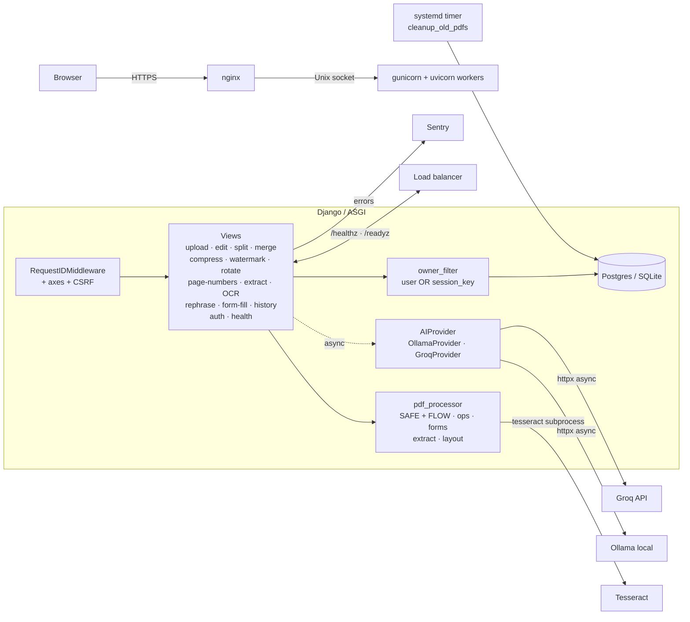

# PDF Editor v2

[](https://github.com/Alexandru2984/pdf_Editor_v2/actions/workflows/test.yml)

Django web app for editing PDFs in-place. Find/replace text, split/merge/compress,
watermark, rotate, page numbers, OCR, AcroForm fill, and AI-powered rephrase via
Ollama (local) or Groq (cloud). Works with or without an account — anonymous
sessions and registered users are isolated from each other at the query layer.

**Live demo:** <https://pdf.micutu.com>

## What makes this non-trivial

Editing text *inside* an existing PDF is fundamentally harder than generating a
new one. PyMuPDF operates on coordinate rectangles, not paragraphs, so replacing
"lorem ipsum" in a document means:

1. Finding the exact bounding box of the original span.
2. Detecting the paragraph and column it belongs to (line gap, font size, alignment).
3. Redacting that area and inserting replacement text at the same coordinates with
   a font that approximates the original.
4. In **FLOW mode**, shifting all text below by the height delta — and *extending
   the page* if the new text overflows.

The interesting code lives in `pdfeditor/pdf_processor/_layout.py` and
`pdfeditor/pdf_processor/edit.py`.

## Architecture



```
pdf_project/            Django project (settings, urls, wsgi, asgi)
pdfeditor/
├── models.py           UploadedPDF, ProcessedPDF — owned by user OR anon session
├── ai_service.py       OllamaProvider + GroqProvider, sync + async (httpx) variants
├── ratelimiting.py     auth_aware_ratelimit — per-user when auth, per-IP otherwise
├── middleware.py       Request-ID injection (X-Request-Id) + log filter
├── email_utils.py      Confirmation token signing + send helpers
├── pdf_processor/      PDF manipulation package (no Django imports → standalone)
│   ├── _common.py      Paths, page-range parsing, font/color mapping
│   ├── _layout.py      Span/Line/Block model, paragraph detection, block shifting
│   ├── edit.py         SAFE + FLOW text replacement, find/replace, coord rephrase
│   ├── ops.py          Split, merge, compress, watermark, rotate, page numbers
│   ├── extract.py      Text-layer + OCR extraction
│   └── forms.py        AcroForm field detection + filling (with optional flatten)
├── views/              HTTP views grouped by concern
│   ├── _common.py      owner_filter Q-pattern, guarded media serving
│   ├── auth.py         Register, email confirmation, resend
│   ├── upload.py       Magic-byte + page-count validation
│   ├── edit.py         Find/replace + result + preview
│   ├── basic_ops.py    Split / merge / compress
│   ├── layout_ops.py   Watermark / rotate / page-numbers
│   ├── extract.py      Text + OCR (rate-limited)
│   ├── rephrase.py     AI rephrase (async preview endpoint)
│   ├── form_fill.py    AcroForm fill + flatten
│   ├── history.py      Per-owner history of processed PDFs
│   └── health.py       /healthz (liveness) + /readyz (DB check)
├── templates/          Django templates (PDF.js viewer + auth flow)
└── management/commands/
    └── cleanup_old_pdfs.py
```

## Feature overview

| Area | Description |
|------|-------------|
| Auth | Register · email confirmation · login/logout · password change/reset · resend confirmation |
| Find & replace | Document-wide, case-sensitive/insensitive, page-range filter, SAFE + FLOW modes |
| AI rephrase | Select region → Ollama (local) or Groq (cloud) → paste back with paragraph reflow |
| Split / merge | Arbitrary page ranges; merge multiple uploads in chosen order |
| Compress | JPEG re-encoding of embedded images, 3 quality presets |
| Watermark | Text or image, 9 positions, opacity + rotation |
| Rotate | 90 / 180 / 270° on selected pages |
| Page numbers | Position + format + font size + start page |
| Extract / OCR | Text-layer extraction or Tesseract OCR fallback |
| Form fill | Detect AcroForm widgets, fill text/checkbox/radio/combobox, optional flatten |
| History | Per-user (or per-session for anon) list of every output, with preview/download/delete |

## Ownership model

Anonymous users get a Django `session_key`; authenticated users get a `User` FK.
Both fields exist on the same row, and a single `owner_filter(request)` helper
returns the appropriate `Q()` for every query, so:

- Anonymous PDFs never appear to a logged-in user (or to *another* anonymous browser).
- Logging in does **not** absorb the previous anonymous session's PDFs — they
  remain anon-scoped (and get cleaned up on schedule).
- A user's PDFs persist across browsers, devices, and session resets.

The same filter gates `/media/` access — direct URL guesses return 404 unless
the row matches the requester's user/session.

## Operations & observability

- **Health endpoints**: `/healthz` (liveness) and `/readyz` (DB ping).
- **Request-ID middleware**: every response carries `X-Request-Id` (a UUID4 or the
  inbound `X-Request-Id` header if the upstream proxy supplies one). The same ID
  is injected into every `pdfeditor.*` log line via a `contextvar` filter.
- **Sentry**: enabled when `SENTRY_DSN` is set. Captures errors and 0.1× of
  transactions; tagged with environment.
- **Auth-aware rate limiting**: `pdfeditor.ratelimiting.auth_aware_ratelimit` keys
  by `user.pk` for authenticated requests and by `REMOTE_ADDR` otherwise, with
  separate quotas per state. OCR is the tightest bucket (10/h anon, 40/h user)
  because rasterising at 300 DPI then running tesseract is CPU-expensive.

## Security posture

`python manage.py check --deploy --fail-level WARNING` reports zero warnings.

- `SECRET_KEY`, `ALLOWED_HOSTS`, secrets read from `.env` (chmod 600 in prod).
- HTTPS hardening: `SECURE_SSL_REDIRECT`, HSTS preload, `SECURE_PROXY_SSL_HEADER`,
  Secure + HttpOnly + SameSite cookies (gated by a `TESTING` flag).
- Upload validation: `%PDF-` magic bytes, 10 MB size cap, page-count cap (default
  500, env-configurable), `basename()` sanitation.
- `django-axes` — 5 failed admin logins per (IP, username) → 1h lockout.
- `auth_aware_ratelimit` on every AI/OCR/extract endpoint.
- CSRF on every POST, including async AJAX endpoints.
- Path-traversal guard in `serve_media_view`: `realpath` + `startswith(MEDIA_ROOT)`
  before the ownership check.
- Email confirmation token uses Django's `default_token_generator` — single-use
  (the seed includes `is_active`, so the token invalidates the moment the
  account becomes active).

## Testing & quality

| | |
|--|--|
| Tests | **325** (1 skipped without `tesseract`) — `python manage.py test pdfeditor` |
| Coverage | **90%** (`coverage run` → `coverage report`) |
| Type checking | mypy clean on 32 source files; strict on `pdf_processor/` and `ai_service.py` |
| Linting | ruff (lint + format), config in `pyproject.toml` |
| Pre-commit | `.pre-commit-config.yaml` runs ruff + mypy + standard hooks |
| CI | GitHub Actions matrix on Python 3.10/3.11/3.12 |
| Dependabot | Weekly `pip` + `github-actions` + `docker` updates |

## Running locally

```bash
git clone https://github.com/Alexandru2984/pdf_Editor_v2.git
cd pdf_Editor_v2
python3 -m venv venv
source venv/bin/activate
pip install -r requirements.txt

cat > .env <<'EOF'
DEBUG=True
SECRET_KEY='pick-something-long-and-random-min-50-chars'
ALLOWED_HOSTS=localhost,127.0.0.1
SECURE_SSL=0
# Optional: GROQ_API_KEY=gsk_...
# Optional: SENTRY_DSN=https://...
EOF
chmod 600 .env

python manage.py migrate
python manage.py test pdfeditor
python manage.py runserver
```

Open <http://localhost:8000>. For AI rephrase you need either a running Ollama
instance (`OLLAMA_HOST` env var) or a Groq API key in `.env`. OCR needs
`tesseract` on the system `PATH`. Email confirmation prints to the console in
DEBUG mode.

### Docker

```bash
echo "POSTGRES_PASSWORD=$(openssl rand -hex 16)" >> .env
echo "SECRET_KEY=$(openssl rand -hex 32)" >> .env
docker compose up --build
```

The compose file launches Postgres + the app under uvicorn workers (so async
AI endpoints actually free up workers during slow upstream calls).

## Production deployment

The live instance runs behind nginx → gunicorn (with uvicorn workers, for ASGI)
over a Unix socket, managed by two systemd units:

- `pdfeditor.service` — `gunicorn pdf_project.asgi:application -k uvicorn.workers.UvicornWorker`
  with 3 workers, `EnvironmentFile=.env`.
- `pdfeditor-cleanup.timer` — hourly run of `cleanup_old_pdfs`, which deletes
  DB rows and files older than `PDF_CLEANUP_HOURS` plus orphan files on disk.

## Tech stack

Django 4.2 · PyMuPDF (fitz) · Pillow · pytesseract · django-axes ·
django-ratelimit · httpx (async) · sentry-sdk · psycopg2 · dj-database-url ·
python-dotenv · gunicorn · uvicorn · systemd. AI providers: Ollama (local) and
Groq (cloud), both behind an `AIProvider` interface so new providers slot in
with a single class.

## Known limitations (FLOW mode)

- Bullet/list markers are detected to avoid being swallowed into the wrong
  paragraph, but the markers themselves aren't re-inserted when blocks shift.
- Multi-column tables and complex layouts may reflow incorrectly; SAFE mode is
  the fallback when paragraph detection fails.
- Signature widgets in AcroForms are read but never filled — they need a cert,
  which is out of scope.
