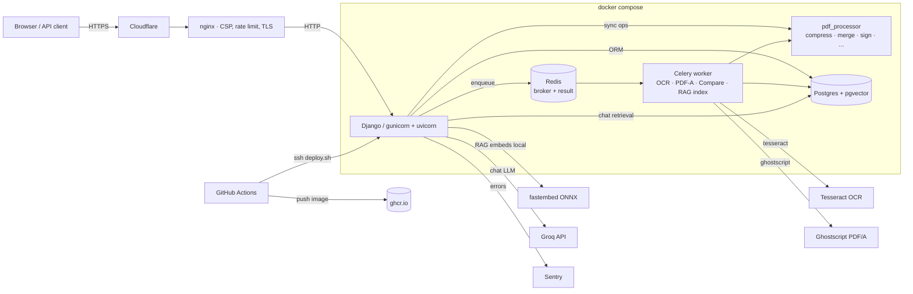

# PDF Editor v2

[](https://github.com/Alexandru2984/pdf_Editor_v2/actions/workflows/test.yml)
[](https://github.com/Alexandru2984/pdf_Editor_v2/actions/workflows/deploy.yml)


> **A self-hosted PDF toolbox with REST API, async pipeline, and AI chat over your documents.**

**Live:** <https://pdf.micutu.com>  ·  **API docs:** <https://pdf.micutu.com/api/v1/docs/>

PDF Editor is a Django web app that turns 25+ PDF operations into a single
self-hosted service — split, merge, OCR, redact, sign, compare, convert,
even **chat with your PDFs** using a local vector store + LLM. Built to be
production-grade: REST API with OpenAPI schema, async job pipeline on Celery,
per-user storage quotas, full audit log, share links, and a security CI
gate that blocks deploys on critical CVEs.

---

## Highlights

- **🧰 25+ PDF operations** — find/replace, split, merge, compress, watermark,
  rotate, page numbers, OCR layer, AcroForm fill, password protect/remove,
  crop, flatten, redact, PDF/A, compare, outline editor, PDF→DOCX, PDF→images,
  images→PDF, metadata editor, reorder, digital signature (PKCS#7 + LTV + TSA)
- **🤖 Chat with PDF (RAG)** — `pgvector` for retrieval, multilingual ONNX
  embeddings (`fastembed`), Groq LLM with model picker and live citations
- **🔌 REST API + OpenAPI** — `/api/v1/docs/` Swagger UI, `/api/v1/redoc/` Redoc,
  per-user API keys, throttling, full operation coverage
- **⚡ Async pipeline** — Celery + Redis for long ops (OCR/PDF-A/Compare/Chat
  indexing); web returns 202 with `job_id`, frontend polls live status
- **🔐 Production-grade auth** — registration + email confirmation, password
  reset, account export (GDPR), TOTP-free 2FA via signed tokens; storage
  quotas (50MB anon / 500MB user); share links with TTL + download caps
- **📊 Audit + observability** — `AuditLog` model for every operation
  (who/what/when/IP/UA), Sentry error tracking, request-ID tracing
- **🚦 Auto-deploy** — push to main → GitHub Actions builds image → pushes
  to GHCR → SSH deploys to VPS → restarts containers, all gated by tests +
  Trivy image scan

## Architecture



## Tech stack

**Backend** Python 3.12 · Django 5.2 LTS · DRF + drf-spectacular · Celery 5 ·
PyMuPDF (fitz) · pyHanko (digital signatures) · pdf2docx · pytesseract ·
Pillow · pgvector · fastembed (ONNX) · httpx · django-axes · django-ratelimit

**Infra** PostgreSQL 16 + pgvector · Redis 7 · Nginx · gunicorn (uvicorn
workers) · Docker Compose · GitHub Actions · GitHub Container Registry ·
Cloudflare · systemd timers (cleanup)

**LLM / AI** Groq API (Llama 3.3 70B, GPT-OSS 120B, Llama 4 Scout) · Ollama
(local fallback) · HuggingFace `paraphrase-multilingual-MiniLM-L12-v2` (RAG)

**Security** Bandit (SAST) · pip-audit (dep CVEs) · Trivy (image scan) ·
SHA-256 API key hashes · CSP enforced · HSTS preload · `realpath` path
guard · audit log

## Features at a glance

| Category | Operations |
|----------|------------|
| **Text** | Find & replace (SAFE + FLOW), redact, AI rephrase |
| **Layout** | Crop, flatten, rotate, page numbers, watermark, reorder/delete pages, edit bookmarks/outline |
| **Convert** | PDF→DOCX, PDF→images (PNG/JPG with DPI), images→PDF |
| **Compose** | Split, merge, compare two PDFs |
| **Security** | Password protect, remove password, digital signature (PKCS#7 / PAdES B-B/B-T/B-LT/B-LTA), verify signatures |
| **Compliance** | PDF/A-1b · PDF/A-2b (via ghostscript) |
| **Recognition** | OCR text extraction · embed OCR text layer (searchable PDF) |
| **Metadata** | Read + edit title/author/keywords/dates |
| **Forms** | Detect AcroForm fields, fill, optional flatten |
| **AI** | Chat with PDF (RAG) · rephrase regions · auto-summarize via Groq |
| **Sharing** | Public token links with TTL + download caps |
| **Admin** | API keys, audit log, storage quotas, history |

## REST API quick start

```bash
# Get an API key from /accounts/profile/ → "Create API key"
export API_KEY="your_token_here"
export BASE="https://pdf.micutu.com/api/v1"

# Upload a PDF
curl -X POST -H "X-API-Key: $API_KEY" \
  -F "pdf_file=@invoice.pdf" $BASE/pdfs/

# Compress it
curl -X POST -H "X-API-Key: $API_KEY" -H "Content-Type: application/json" \
  -d '{"pdf_id":"<uuid>","quality":"medium"}' \
  $BASE/ops/compress/

# Queue OCR (returns 202 + job_id, poll /jobs/<id>/ for status)
curl -X POST -H "X-API-Key: $API_KEY" -H "Content-Type: application/json" \
  -d '{"pdf_id":"<uuid>","language":"eng+ron","dpi":200}' \
  $BASE/ops/searchable/

# Chat with an indexed PDF
curl -X POST -H "X-API-Key: $API_KEY" -H "Content-Type: application/json" \
  -d '{"pdf_id":"<uuid>","message":"Summarize the conclusion"}' \
  $BASE/ops/chat/
```

Full spec at `/api/v1/schema/` (OpenAPI 3.0 YAML), interactive docs at
`/api/v1/docs/` (Swagger UI) and `/api/v1/redoc/` (Redoc).

## RAG (Chat with PDF) — how it works


Multi-PDF retrieval — pick several already-indexed documents and the query
ranks chunks across all of them, with per-citation document attribution.

## Async job pipeline

Long-running ops (OCR, PDF/A, Compare, RAG indexing) run in a separate Celery
worker container. The flow:

1. Web view validates input, creates a `Job` row (`status=queued`), calls
   `task.delay(job_id)`, returns **HTTP 302** (web) or **202** (API) with the
   job id.
2. Frontend polls `/jobs/<id>/status/` every 2s — lightweight JSON endpoint
   that shows `status` (`queued|running|done|failed`), `progress`, optional
   `error_message`, and `follow_up_url` once done.
3. Worker picks up the task, updates `status=running`, runs the underlying
   `pdf_processor` function, on success creates a `ProcessedPDF` row and
   links it back to the `Job` (`status=done`), on failure stores a friendly
   `error_message`.
4. Result page detects `status=done`, auto-redirects to download or follow-up.

In CI, `CELERY_TASK_ALWAYS_EAGER=True` runs tasks inline so tests don't need
a broker.

## Security posture

- **CI security gate** — every push runs `bandit` (SAST), `pip-audit`
  (dep CVEs), and on deploy `trivy` (image scan with `ignore-unfixed:true`,
  fail on HIGH/CRITICAL).
- **Auth** — Django sessions + per-user API keys (SHA-256 hashed, plaintext
  shown once). `django-axes` locks login after 5 failures.
- **CSRF** on every state-changing endpoint, including JSON POSTs.
- **Rate limits** — `auth_aware_ratelimit` per-user-or-IP, with stricter
  buckets on expensive ops (OCR 10/h anon, 40/h user; chat 10/h / 100/h).
- **CSP enforced** at nginx (no report-only) — script-src/connect-src
  allowlists.
- **HSTS preload**, secure + HttpOnly + SameSite cookies, HTTPS-only.
- **Path traversal** blocked via `realpath` + ownership check on every
  `/media/` access.
- **Audit log** — every operation captures user, IP, user-agent, kind,
  source + output names, timestamps.
- **Disclosure policy:** [SECURITY.md](SECURITY.md).

## Testing & quality

| Check | Status |
|-------|--------|
| Test count | **665 passing** (Postgres + pgvector required) |
| Coverage | reports uploaded as CI artifact (`coverage.xml`) |
| Linting | `ruff check` + `ruff format` |
| Types | `mypy` strict on `pdf_processor/` |
| SAST | `bandit` (config in `pyproject.toml`) |
| CVE scan | `pip-audit` blocks PRs with known fixable CVEs |
| Image scan | `trivy` blocks deploys on HIGH/CRITICAL OS/library CVEs |
| Python matrix | 3.10 · 3.11 · 3.12 (parallel in CI) |
| Auto-update | Dependabot weekly (`pip` + `github-actions` + `docker`) |

## Running locally

### Docker (recommended)

```bash
git clone https://github.com/Alexandru2984/pdf_Editor_v2.git
cd pdf_Editor_v2
cat > .env <<EOF
SECRET_KEY=$(openssl rand -hex 32)
POSTGRES_PASSWORD=$(openssl rand -hex 16)
DEBUG=False
ALLOWED_HOSTS=localhost,127.0.0.1
GROQ_API_KEY=  # optional, enables chat
EOF
docker compose up --build
```

Open <http://localhost:8000>. The compose file starts Postgres+pgvector,
Redis, the Django web app, and the Celery worker as separate services.

### Bare-metal

```bash
python3.12 -m venv venv && source venv/bin/activate
pip install -r requirements.txt
sudo apt-get install -y tesseract-ocr tesseract-ocr-ron ghostscript
python manage.py migrate
python manage.py test pdfeditor   # 665 tests, needs Postgres+pgvector
python manage.py runserver
```

For chat / RAG you also need a running Celery worker:

```bash
celery -A pdf_project worker --loglevel=info
```

## Auto-deploy

Pushes to `main` trigger:

1. **`tests` workflow** — Python 3.10/3.11/3.12 matrix, ruff + mypy + bandit
   + pip-audit + 665 tests + Django deploy check.
2. **`build-and-deploy`** (workflow_run after tests success) — builds the
   image, pushes to `ghcr.io/alexandru2984/pdf_editor_v2:{latest,sha-XXXXX}`,
   scans with Trivy (fail on HIGH/CRITICAL), then SSHes into the VPS and
   runs `scripts/deploy.sh` which pulls the new image, retags the previous
   as `pdfeditor:rollback`, and `docker compose up -d --no-build`.

Rollback is a one-liner: `docker tag pdfeditor:rollback pdfeditor:latest && docker compose up -d --no-build`.

Setup details in [.github/DEPLOY.md](.github/DEPLOY.md).

## Roadmap

✅ Done

- 25+ PDF operations · digital signatures with PAdES B-B/B-T/B-LT/B-LTA
- REST API + OpenAPI/Swagger/Redoc · per-user API keys + throttling
- Celery + Redis async pipeline · job status polling
- RAG chat (pgvector + ONNX embeddings + Groq) · multi-PDF retrieval · LLM picker
- Audit log · storage quotas · share links · API keys
- Auto-deploy CI/CD (GHCR + Trivy + SSH) · Sentry error tracking
- Multi-language (EN + RO) · CSP enforced · 665 tests

🚧 In progress / next

- Prometheus `/metrics` + Grafana dashboard
- PWA (installable, offline cache) + dark mode toggle
- Load testing scenarios with Locust
- ADRs (architecture decision records) for the major design choices

## Project structure

```
pdf_project/            Django project (settings, urls, asgi, celery)
pdfeditor/
├── models.py           UploadedPDF, ProcessedPDF, Job, Embedding,
│                       ShareLink, ApiKey, AuditLog, TrustAnchor
├── tasks.py            Celery tasks (OCR, PDF/A, Compare, Convert, RAG index)
├── ratelimiting.py     auth_aware_ratelimit decorator
├── ai_service.py       Ollama + Groq providers (sync + async)
├── pdf_processor/      Standalone PDF lib (no Django imports)
│   ├── ops.py          Split/merge/compress/redact/crop/flatten/PDF-A/…
│   ├── edit.py         Find/replace SAFE + FLOW, rephrase
│   ├── extract.py      Text + OCR + searchable PDF
│   ├── forms.py        AcroForm detect + fill
│   └── rag.py          Chunking + embeddings
├── api/                DRF endpoints (pdfs · outputs · ops · jobs · chat)
│   ├── auth.py         X-API-Key auth + OpenAPI extension
│   ├── throttles.py    Per-API-key rate limiting
│   └── serializers.py
├── views/              HTTP views grouped by concern
│   ├── basic_ops.py    Split/merge/compress/convert/protect/etc.
│   ├── layout_ops.py   Crop/rotate/watermark/page-numbers/reorder
│   ├── chat.py         RAG chat with PDF
│   ├── jobs.py         Job status + listing
│   ├── share.py        Public token download links
│   └── …
└── templates/          Django templates + chat UI + admin
```

## License

MIT — see [LICENSE](LICENSE).
