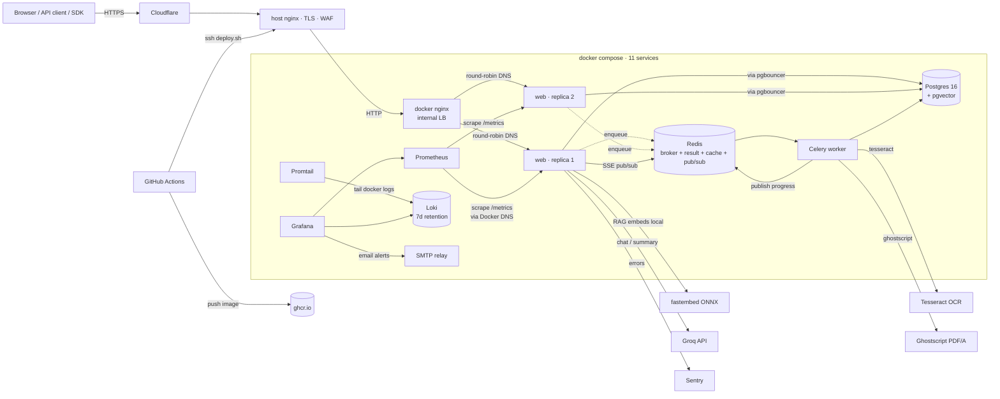
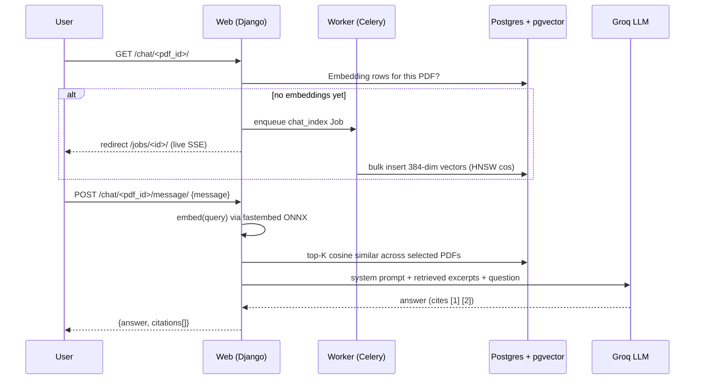

# PDF Editor v2

[](https://github.com/Alexandru2984/pdf_Editor_v2/actions/workflows/test.yml)
[](https://github.com/Alexandru2984/pdf_Editor_v2/actions/workflows/deploy.yml)


> **Self-hosted PDF toolbox with REST API, async pipeline, AI chat over your documents, and a full observability stack.**

**Live demo:** <https://pdf.micutu.com> · **API docs:** <https://pdf.micutu.com/api/v1/docs/> · **SDK:** [`sdk/`](sdk/)

PDF Editor turns 25+ PDF operations into a single self-hosted service — split,
merge, OCR, redact, sign, compare, convert, even **chat with your PDFs** via a
local vector store + LLM. Built production-grade end-to-end: REST API with
OpenAPI schema, async job pipeline on Celery with live SSE progress, horizontal
scaling behind an internal nginx load balancer, Prometheus + Grafana + Loki
observability with email alerting, scope-aware rate limiting, full audit log,
and a CI gate that blocks deploys on critical CVEs.

---

## By the numbers

| | Result |
|---|---|
| **Sustained load** | **500 concurrent users**, 53,580 requests over 5 min, **0.15% failure rate** |
| **Peak throughput** | **179 req/s** at 8 workers across 2 replicas (+48% vs single-replica baseline) |
| **Endpoint speedup story** | `/api/v1/outputs/` **60s → 1.2s** after pagination + cache + DB tuning |
| **Tests** | **833 passing** across Django + SDK · 3.10/3.11/3.12 matrix · pgvector required |
| **Lines of Python** | ~21,500 (excluding migrations) |
| **PDF ops** | 25+, all reachable both from web UI and REST API |
| **Async jobs** | 6 kinds (OCR, PDF/A, Compare, Convert, RAG-index, ToImages) — sub-5-page sync, threshold-async |
| **Security review** | No exploitable findings (path traversal, SSE auth, race conditions, XSS, open redirect, Redis pub/sub all clean) |
| **Compose services** | 12 (db · pgbouncer · redis · migrate · web×N · worker · nginx · clamav · prometheus · grafana · loki · promtail) |

Full benchmark write-up with per-endpoint p95 and the tuning story in [`scripts/loadtest/benchmarks.md`](scripts/loadtest/benchmarks.md).

## Highlights

- **🧰 25+ PDF operations** — find/replace, split, merge, compress, watermark,
  rotate, page numbers, OCR layer, AcroForm fill, password protect/remove,
  crop, flatten, redact, PDF/A, compare, outline editor, PDF→DOCX, PDF→images,
  images→PDF, metadata editor, reorder, digital signature (PKCS#7 + LTV + TSA)
- **🤖 Chat with PDF (RAG)** — `pgvector` for retrieval, multilingual ONNX
  embeddings (`fastembed`), Groq LLM with model picker and live citations.
  Plus a single-shot `/ops/summarize/` endpoint for tldr-style summaries.
- **🔌 REST API + Python SDK** — OpenAPI 3 schema, Swagger UI, Redoc; per-user
  API keys with **scope-aware throttling** (read / op / upload with separate
  buckets per auth method); thin `pdf-editor-sdk` package with a `pdf-edit` CLI.
- **⚡ Async pipeline with live progress** — Celery + Redis for long ops; web
  returns 202 with `job_id`; **Server-Sent Events** stream per-page progress
  to the browser via Redis pub/sub, with polling fallback. Cancel mid-flight
  via SIGTERM revoke.
- **🪣 Batch operations** — `POST /api/v1/ops/batch/` applies one op to up to
  50 owned PDFs in a single Celery job with incremental progress; partial
  success allowed (`done` if any PDF succeeded, per-row error capture).
- **📈 Full observability stack** — Prometheus scrapes web replicas via Docker
  DNS service discovery; Grafana dashboard with 13 panels + variable for
  per-replica drill-down; **Loki + Promtail** for cross-container log search;
  4 provisioned alert rules (5xx spike, p95 latency, queue depth, replicas
  down) that email through the app's own SMTP relay.
- **🔐 Production-grade auth + security** — registration + email confirmation,
  TOTP two-factor auth with single-use backup codes, WebAuthn **passkeys**,
  active-session management with new-device login alerts, password reset,
  GDPR account export + self-service delete, privacy policy + ToS pages
  (RO/EN), share links with TTL + download caps, SHA-256-hashed API keys,
  `django-axes` lockout, strict nonce-based CSP with `/csp-report/`
  violation endpoint, HSTS preload, realpath path-traversal guard, ClamAV
  upload scanning, full audit log.
- **🌐 Horizontal scaling** — `web` service runs N replicas (default 2) behind
  an internal `nginx` load balancer that picks up scale changes via Docker's
  embedded DNS without a reload (`docker compose up --scale web=N`).
- **🚦 Auto-deploy** — push to main → GitHub Actions builds image → pushes
  to GHCR → SSH deploys to VPS → migrations run as a one-shot init container
  (no migration race across replicas), Trivy gates on HIGH/CRITICAL CVEs.
- **📱 PWA** — installable, offline app shell via service worker, browser
  notification when a long job finishes while the tab is backgrounded.

## Architecture



## Tech stack

**Backend** Python 3.12 · Django 5.2 LTS · DRF + drf-spectacular · Celery 5 ·
PyMuPDF (fitz) · pyHanko (digital signatures) · pdf2docx · pytesseract ·
Pillow · pgvector · fastembed (ONNX) · httpx · django-axes · django-ratelimit

**Infra** PostgreSQL 16 + pgvector · PgBouncer (transaction pooling, 1000
client conns → 25 server conns) · Redis 7 · nginx (TLS host + internal LB) ·
gunicorn (uvicorn ASGI workers) · Docker Compose · GitHub Actions · GHCR ·
Cloudflare · systemd timers (cleanup, daily backup)

**Observability** Prometheus 2.55 (DNS service discovery for replicas) ·
Grafana 11 (provisioned datasource + dashboard + alert rules) · Loki 3 +
Promtail (container log shipping) · `django-prometheus` middleware + custom
business metrics · Sentry (optional — set `SENTRY_DSN`) · request-ID tracing
via custom middleware · `/healthz` + `/readyz` endpoints

**LLM / AI** Groq API (Llama 3.3 70B + others, model picker) · Ollama
(local fallback for rephrase) · HuggingFace `paraphrase-multilingual-MiniLM-L12-v2`
embeddings · 80k-char context cap with truncation flag

**Security** Bandit (SAST) · pip-audit (dep CVEs) · Trivy (image scan,
fail on HIGH/CRITICAL with `ignore-unfixed:true`) · SPDX SBOM + cosign
keyless image signing · TOTP MFA + WebAuthn passkeys · ClamAV upload
scanning · SHA-256 API key hashes · strict nonce-based CSP (enforced, with
report endpoint) · HSTS preload · `realpath` path guard

## Features at a glance

| Category | Operations |
|----------|------------|
| **Text** | Find & replace (SAFE + FLOW), redact, AI rephrase |
| **Layout** | Crop, flatten, rotate, page numbers, watermark, reorder/delete pages, edit bookmarks/outline |
| **Convert** | PDF→DOCX, PDF→images (PNG/JPG with DPI), images→PDF |
| **Compose** | Split, merge, compare two PDFs |
| **Security** | Password protect, remove password, digital signature (PKCS#7 / PAdES B-B/B-T/B-LT/B-LTA), verify signatures |
| **Compliance** | PDF/A-1b · PDF/A-2b (via ghostscript) |
| **Recognition** | OCR text extraction · embed OCR text layer (searchable PDF) |
| **Metadata** | Read + edit title/author/keywords/dates |
| **Forms** | Detect AcroForm fields, fill, optional flatten |
| **AI** | Chat with PDF (RAG, multi-doc) · single-shot summarize · rephrase regions |
| **Batch** | Apply one op to up to 50 PDFs in a single Celery job, with live progress |
| **Sharing** | Public token links with TTL + download caps |
| **Account security** | TOTP 2FA + backup codes, passkeys (WebAuthn), session manager with revoke + new-device alerts, GDPR export/delete |
| **Admin** | API keys, audit log, storage quotas, history, health dashboard |

## REST API quick start

```bash
# Get an API key from /accounts/profile/ → "Create API key"
export API_KEY="your_token_here"
export BASE="https://pdf.micutu.com/api/v1"

# Upload a PDF
curl -X POST -H "X-API-Key: $API_KEY" \
  -F "pdf_file=@invoice.pdf" $BASE/pdfs/

# Compress it (sync)
curl -X POST -H "X-API-Key: $API_KEY" -H "Content-Type: application/json" \
  -d '{"pdf_id":"<uuid>","quality":"medium"}' \
  $BASE/ops/compress/

# Batch: apply compress to 3 PDFs in one async job
curl -X POST -H "X-API-Key: $API_KEY" -H "Content-Type: application/json" \
  -d '{"op":"compress","pdf_ids":["<u1>","<u2>","<u3>"],"params":{"quality":"low"}}' \
  $BASE/ops/batch/

# Queue OCR (202 + job_id; poll /jobs/<id>/ OR subscribe to SSE)
curl -X POST -H "X-API-Key: $API_KEY" -H "Content-Type: application/json" \
  -d '{"pdf_id":"<uuid>","language":"eng+ron","dpi":200}' \
  $BASE/ops/searchable/

# Single-shot AI summary
curl -X POST -H "X-API-Key: $API_KEY" -H "Content-Type: application/json" \
  -d '{"pdf_id":"<uuid>","language":"Romanian"}' \
  $BASE/ops/summarize/

# Live job progress over SSE
curl -N -H "X-API-Key: $API_KEY" $BASE/../jobs/<id>/events/

# List + filter jobs
curl -H "X-API-Key: $API_KEY" "$BASE/jobs/?status=queued&status=running"

# Cancel a running job (SIGTERM revoke + mark failed)
curl -X POST -H "X-API-Key: $API_KEY" $BASE/jobs/<id>/cancel/
```

Full spec at `/api/v1/schema/` (OpenAPI 3.0), interactive docs at
`/api/v1/docs/` (Swagger) and `/api/v1/redoc/` (Redoc).

## Python SDK + CLI

A thin client package lives in [`sdk/`](sdk/) — single runtime dep (`requests`).

```python
from pdf_editor import PdfEditorClient

c = PdfEditorClient("https://pdf.micutu.com", api_key="...")

pdf = c.upload("report.pdf")
out = c.compress(pdf["id"], quality="medium")
c.download(out["id"], "report-small.pdf")

# Async ops — wait_for polls until terminal
job = c.wait_for(c.ocr(pdf["id"], language="eng+ron"))
c.download(job["output_id"], "report-ocr.pdf")

# AI summary in one call
print(c.summarize(pdf["id"], language="English")["summary"])

# Batch + filter
submit = c.batch("compress", [p["id"] for p in c.list_pdfs()["results"]], params={"quality": "low"})
job = c.wait_for(submit, timeout=600)
```

CLI:

```bash
pip install -e sdk/   # or from PyPI once published
export PDF_EDITOR_URL=https://pdf.micutu.com PDF_EDITOR_API_KEY=...
pdf-edit upload report.pdf
pdf-edit summarize <pdf-id> --language Romanian
pdf-edit batch compress id1 id2 id3 --params '{"quality":"low"}'
pdf-edit list jobs --status queued --status running
```

## RAG (Chat with PDF) — how it works



Multi-PDF retrieval — pick several already-indexed documents and the query
ranks chunks across all of them, with per-citation document attribution.

## Async job pipeline

Long-running ops (OCR, PDF/A, Compare, Convert, RAG indexing, ToImages above
the page threshold) run in a separate Celery worker container. The flow:

1. Web view validates input, creates a `Job` row (`status=queued`), captures
   the Celery `task_id` on the row (so it's revocable later), returns **302**
   (web) or **202** (API) with the job id.
2. Frontend subscribes to **Server-Sent Events** at `/jobs/<id>/events/` —
   the SSE view tails a `job:<uuid>` Redis pub/sub channel that the worker
   publishes to on every state change. Polling fallback at `/jobs/<id>/status/`
   for clients/proxies that can't keep an EventSource open.
3. Worker picks up the task, updates `status=running`, runs the underlying
   `pdf_processor` function with a progress callback (per-page for ToImages),
   creates the `ProcessedPDF` row(s) on success, links them back, publishes
   the terminal event.
4. Cancel: `POST /jobs/<id>/cancel/` revokes via `app.control.revoke(...,
   terminate=True, signal="SIGTERM")` and marks the row failed with
   `"Cancelled by user"`.

In CI, `CELERY_TASK_ALWAYS_EAGER=True` runs tasks inline so tests don't need
a broker.

## Observability

Provisioned out of the box — `docker compose up -d` brings the full stack
online with no manual UI clicks.

| Component | Role | Host port |
|---|---|---|
| **Prometheus** | Scrapes `web:8000/metrics` from every replica via Docker DNS service discovery; 15-day retention | 9091 (loopback) |
| **Grafana** | Provisioned datasource + 13-panel dashboard with per-replica drill-down · 4 alert rules → email | 3003 (loopback) |
| **Loki** | Stores logs (7-day retention), exposed as a Grafana datasource | 3100 (loopback) |
| **Promtail** | Tails container stdout/stderr via the docker socket; labels logs with the compose service name | — |

Custom business metrics (in `pdfeditor/metrics.py`):
`pdfeditor_op_total{kind,outcome}` · `pdfeditor_op_duration_seconds` ·
`pdfeditor_job_queue_depth{status}` · `pdfeditor_upload_total` ·
`pdfeditor_api_key_auth_total` · `pdfeditor_chat_latency_seconds` ·
`pdfeditor_embeddings_created_total`.

Alert rules (see [`docker/grafana/provisioning/alerting/rules.yml`](docker/grafana/provisioning/alerting/rules.yml)):
- 5xx error rate > 1 req/s for 5 min — **critical**
- p95 latency > 5 s for 10 min — warning
- Queue depth > 50 jobs for 10 min — warning
- `count(up==1) < 1` for 2 min — **critical**

Critical alerts repeat hourly; warnings every 4 hours. Delivered via the
same SMTP relay the app uses for password resets — no separate notification
service needed.

## Security posture

- **CI security gate** — every push runs `bandit` (SAST), `pip-audit`
  (dep CVEs), and on deploy `trivy` scans the image (fail on HIGH/CRITICAL
  with `ignore-unfixed:true`).
- **Auth** — Django sessions + per-user API keys (SHA-256 hashed, plaintext
  shown once). `django-axes` locks login after 5 failures.
- **Scope-aware rate limits** — 9-cell matrix of `(auth_method × category)`:
  api_key/user/anon × read/op/upload. Each viewset/action picks its bucket;
  uploads cap at 60/h on API keys, anon ops at 10/h.
- **CSRF** on every state-changing endpoint, including JSON POSTs.
- **Strict CSP** — nonce-based script policy set per-request by middleware
  (no `unsafe-inline`/`unsafe-eval` for scripts); violations POST to
  `/csp-report/` (logged + Prometheus counter). Host nginx keeps a baseline
  policy for the admin/API paths.
- **MFA** — TOTP with replay protection and single-use backup codes;
  **passkeys** (WebAuthn, discoverable credentials, user verification
  required); session manager with per-device revoke, "sign out everywhere
  else", and new-device login alert emails.
- **Supply chain** — Trivy image gate, SPDX SBOM published per build,
  cosign keyless image signatures.
- **HSTS preload**, secure + HttpOnly + SameSite cookies, HTTPS-only.
- **Path traversal** blocked via `realpath` + ownership check on every
  `/media/` access.
- **Filesystem ↔ DB consistency** — `post_delete` signal cleans the file
  and thumbnail synchronously when a row is deleted; `sweep_orphan_files`
  management command for ad-hoc reconciliation (dry-run by default).
- **Audit log** — every operation captures user, IP, user-agent, kind,
  source + output names, timestamps.
- **Disclosure policy:** [SECURITY.md](SECURITY.md).

## Testing & quality

| Check | Status |
|-------|--------|
| Test count | **833 passing** (817 Django + 16 SDK; pgvector required for the Django suite) |
| Coverage | reports uploaded as CI artifact (`coverage.xml`) |
| Linting | `ruff check` + `ruff format` |
| Types | `mypy` strict on `pdf_processor/` |
| SAST | `bandit` (config in `pyproject.toml`) |
| CVE scan | `pip-audit` blocks PRs with known fixable CVEs |
| Image scan | `trivy` blocks deploys on HIGH/CRITICAL OS/library CVEs |
| Python matrix | 3.10 · 3.11 · 3.12 (parallel in CI) |
| Auto-update | Dependabot weekly (`pip` + `github-actions` + `docker`) |

## Running locally

### Docker (recommended)

```bash
git clone https://github.com/Alexandru2984/pdf_Editor_v2.git
cd pdf_Editor_v2
cat > .env <<EOF
SECRET_KEY=$(openssl rand -hex 32)
POSTGRES_PASSWORD=$(openssl rand -hex 16)
GRAFANA_ADMIN_PASSWORD=$(openssl rand -hex 16)
DEBUG=False
ALLOWED_HOSTS=localhost,127.0.0.1
GROQ_API_KEY=        # optional, enables chat + summarize
ALERT_EMAIL=         # optional, empty = no email alerts (still visible in Grafana UI)
EOF
docker compose up -d
```

Then:
- App: <http://localhost:8000>
- Grafana: <http://localhost:3003> (admin / value from `.env`)
- Prometheus: <http://localhost:9091>

### Bare-metal

```bash
python3.12 -m venv venv && source venv/bin/activate
pip install -r requirements.txt
sudo apt-get install -y tesseract-ocr tesseract-ocr-ron ghostscript
python manage.py migrate
python manage.py test pdfeditor   # 684 tests, needs Postgres+pgvector
python manage.py runserver
```

For chat / RAG / batch jobs you also need a running Celery worker:

```bash
celery -A pdf_project worker --loglevel=info
```

## Auto-deploy

Pushes to `main` trigger:

1. **`tests` workflow** — Python 3.10/3.11/3.12 matrix, ruff + mypy + bandit
   + pip-audit + 817 Django tests + Django deploy check.
2. **`build-and-deploy`** (workflow_run after tests success) — builds the
   image, pushes to `ghcr.io/alexandru2984/pdf_editor_v2:{latest,sha-XXXXX}`,
   scans with Trivy (fail on HIGH/CRITICAL), publishes an SPDX SBOM and
   signs the image with cosign (keyless), then SSHes into the VPS and
   runs `scripts/deploy.sh` which pulls the new image, retags the previous
   as `pdfeditor:rollback`, and `docker compose up -d --no-build`.

Migrations run as a one-shot `migrate` init container that web/worker
`depends_on` with `service_completed_successfully` — N replicas can't race
through the migration advisory locks at startup.

Rollback is a one-liner:
```bash
docker tag pdfeditor:rollback pdfeditor:latest && docker compose up -d --no-build
```

Setup details in [`.github/DEPLOY.md`](.github/DEPLOY.md).

## Performance highlights

Captured against the live deployment with Locust (full write-up + per-endpoint
p95 in [`scripts/loadtest/benchmarks.md`](scripts/loadtest/benchmarks.md)).

| | Default config | After tuning |
|---|---|---|
| Sustainable concurrent users | ~80 (DB conns exhausted) | **500+ before CPU saturates** |
| Peak throughput | 39 req/s (with 13% 500s) | **179 req/s (0.15% failure)** |
| DB connections at 500u | n/a (crashed at 80u) | **27 / 300** |
| Largest endpoint speedup | — | `/api/v1/outputs/` **60s → 1.2s** |

**What changed:**
1. Postgres `max_connections` 100 → 300 + `shared_buffers=512MB`
2. PgBouncer transaction pooling (1000 client conns → 25 server conns)
3. Redis-backed Django cache (replacing fragmented per-worker `LocMemCache`)
4. Cached-DB sessions (`SESSION_ENGINE=cached_db`)
5. DRF default pagination (`PageNumberPagination`, page_size=50) — fixed a
   60-second `/api/v1/outputs/` that returned 5,713 rows uncapped
6. Schema endpoint cached for 5 min (drf-spectacular has a race condition
   under concurrent first-time generation)
7. `/to-images/` rasterization moved to Celery for PDFs above `ASYNC_THRESHOLD_PAGES`
8. Horizontal scale: 2 `web` replicas behind internal nginx LB — +48 % throughput
   at the same total worker count

## Project structure

```
pdf_project/            Django project (settings, urls, asgi, celery)
pdfeditor/
├── models.py           UploadedPDF, ProcessedPDF, Job, Embedding,
│                       ShareLink, ApiKey, AuditLog, TrustAnchor
├── tasks.py            Celery tasks (OCR, PDF/A, Compare, Convert, RAG index,
│                       ToImages, Batch, cancel_job)
├── ratelimiting.py     auth_aware_ratelimit decorator (UI side)
├── ai_service.py       Ollama + Groq providers (sync + async)
├── metrics.py          Prometheus counters/histograms/gauges
├── signals.py          post_delete cleanup of files + thumbnails
├── pdf_processor/      Standalone PDF lib (no Django imports)
│   ├── ops.py          Split/merge/compress/redact/crop/flatten/PDF-A/…
│   ├── edit.py         Find/replace SAFE + FLOW, rephrase
│   ├── extract.py      Text + OCR + searchable PDF
│   ├── forms.py        AcroForm detect + fill
│   ├── summarize.py    Single-shot LLM summary (uses Groq)
│   └── rag.py          Chunking + embeddings
├── api/                DRF endpoints (pdfs · outputs · ops · jobs · chat · batch · summarize)
│   ├── auth.py         X-API-Key auth + OpenAPI extension
│   ├── throttles.py    ScopedAuthAwareThrottle (9-cell rate matrix)
│   ├── batch_ops.py    Sync-batchable op registry
│   └── serializers.py
├── views/              HTTP views grouped by concern
│   ├── basic_ops.py    Split/merge/compress/convert/protect/etc.
│   ├── layout_ops.py   Crop/rotate/watermark/page-numbers/reorder
│   ├── chat.py         RAG chat with PDF
│   ├── jobs.py         Status + SSE + cancel
│   ├── share.py        Public token download links
│   ├── legal.py        Privacy policy + ToS (per-language templates)
│   └── …
├── management/commands/
│   ├── cleanup_old_pdfs.py     Age-based retention sweep
│   └── sweep_orphan_files.py   Orphan-file reconciliation (dry-run default)
└── templates/          Django templates + chat UI + admin

docker/
├── nginx.conf          Internal LB with Docker DNS resolver
├── prometheus.yml      DNS service discovery for web replicas
├── promtail-config.yml Docker socket → Loki shipper
├── loki-config.yml     Standalone Loki (7d retention)
└── grafana/
    ├── provisioning/   Datasources + dashboards + alerting
    └── dashboards/     pdfeditor.json (13 panels, per-replica drill-down)

sdk/                    Standalone pdf-editor-sdk package
├── pdf_editor/
│   ├── client.py       PdfEditorClient (sync + async ops + wait_for)
│   └── cli.py          pdf-edit CLI
└── tests/              16 unit tests, network mocked

scripts/
├── deploy.sh           Idempotent VPS deploy (pull image, retag, restart)
├── backup_db.sh        pg_dump via compose exec, 14-day rotation
└── loadtest/           Locust profiles + benchmarks.md write-up
```

## License

MIT — see [LICENSE](LICENSE).
